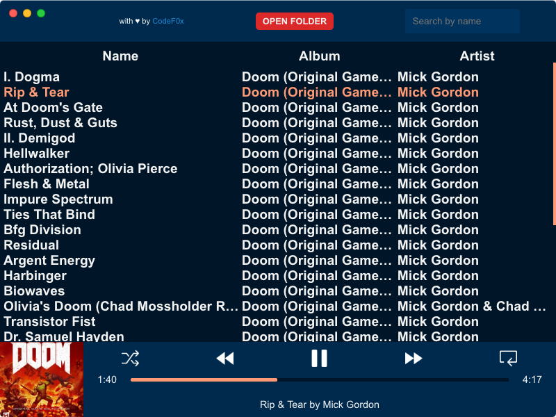

<h1 align="center">Welcome to Violin 👋</h1>
<p>
  <a href="https://snapcraft.io/violin-player">
    
  </a>
  
  
  <a href="https://www.codacy.com/app/CodeF0x/violin?utm_source=github.com&utm_medium=referral&utm_content=CodeF0x/violin&utm_campaign=Badge_Grade">
    
  </a>
  
</p>

> A fast, lightweight, and minimalistic desktop music player.



### 🏠 [Homepage](https://violin-player.cc/)

## Features

| Feature                                               | Supported         |
| ----------------------------------------------------- | ----------------- |
| Open directory and play contents                      | ✅                |
| Display metadata \(album cover, album, song, artist\) | ✅                |
| Media keys \(skip, previous, play / pause\)           | ✅                |
| App has own volume slider                             | ✅                |
| Shuffle                                               | ✅                |
| Endless repeat                                        | ✅                |
| Search song by name                                   | ✅                |
| Sorting \(alphabetically by name, album, artist\)     | ✅                |
| Playlists                                             | ❌                |
| Gapless                                               | ❌ \(may follow\) |
| Open single audio file                                | ❌                |
| Streaming capabilities                                | ❌                |

## Install

### Linux:

```sh
sudo snap install violin-player
```

[](https://snapcraft.io/violin-player)

### MacOS and Windows:

[MacOS installer](https://github.com/CodeF0x/violin/releases/download/v3.1/violin-setup-mac.dmg) | [Windows installer](https://github.com/CodeF0x/violin/releases/download/v3.1/violin-setup-windows.msi)

## Usage

Launch it like any other application on your computer. 🚀

## Author

👤 **Tobias Oettl**

- Github: [@CodeF0x](https://github.com/CodeF0x)

## 🤝 Contributing

Contributions, issues and feature requests are welcome!<br />Before submitting an issue, please take a look on the [wiki](https://github.com/CodeF0x/violin/wiki) first. If your question didn't get answered, feel free to check [issues page](https://github.com/CodeF0x/violin/issues)!

## Show your support

Give a ⭐️ if this project helped you!

## 📝 License

Copyright © 2019 [Tobias Oettl](https://github.com/CodeF0x).<br />
This project is [MIT](https://github.com/CodeF0x/violin/blob/master/LICENSE) licensed.


[Icon by Zaryab213.](https://www.fiverr.com/zaryab213)

---

_This README was generated with ❤️ by [readme-md-generator](https://github.com/kefranabg/readme-md-generator)_
